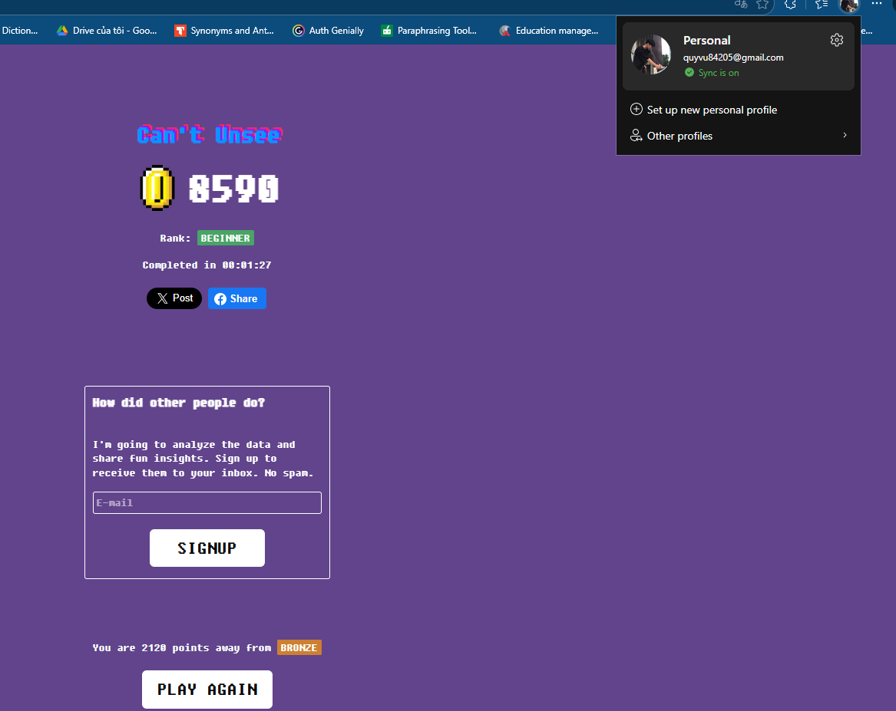
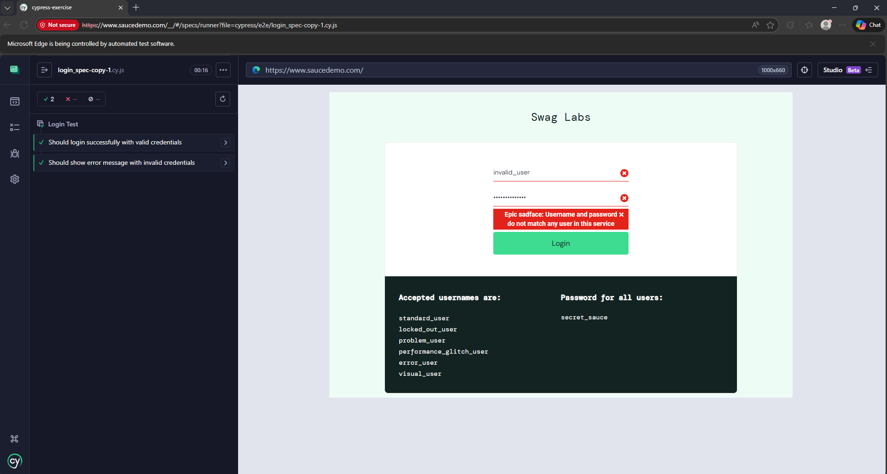
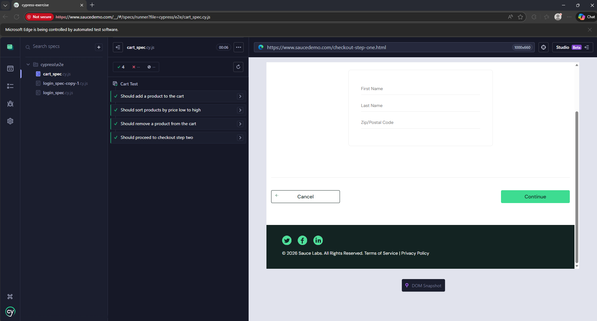

# Báo cáo môn Kiểm thử phần mềm

## Thông tin sinh viên
- **Họ và tên:** Vũ Trọng Quý  
- **Mã sinh viên:** BCS230074  
- **Lớp:** 23CS2  
- **Môn học:** Kiểm thử phần mềm  
- **Giảng viên:** Trương Anh Hoàng  

---

## Cấu trúc Repository

KiemThuPhanMem/
├─ cypress-exercise/ # Bài tập Cypress (E2E SauceDemo)
│ ├─ cypress/
│ │ └─ e2e/
│ │ ├─ login_spec.cy.js
│ │ └─ cart_spec.cy.js
│ ├─ cypress.config.js
│ ├─ package.json
│ └─ package-lock.json
├─ images/ # Minh chứng (ảnh kết quả)
│ ├─ cantunsee.png
│ ├─ login-pass.png # (bạn thêm ảnh này)
│ └─ cart-pass.png # (bạn thêm ảnh này)
└─ README.md

markdown
Sao chép mã

---

# Bài tập ngày 05/01/2026: Can't Unsee (trò chơi luyện lỗi UI/UX)

## Mô tả bài tập
Can't Unsee là một trò chơi nhỏ giúp rèn luyện khả năng phát hiện các lỗi trong thiết kế UI/UX (giao diện người dùng/trải nghiệm người dùng).

Bài tập yêu cầu quan sát và nhận diện các vấn đề liên quan đến:
- Căn chỉnh giao diện
- Khoảng cách giữa các thành phần
- Tính nhất quán trong thiết kế
- Khả năng đọc và trải nghiệm người dùng

🔗 **Liên kết bài tập:** https://cantunsee.space

## Kết quả đạt được
- **Điểm số:** 8590
- **Xếp hạng:** BEGINNER
- **Thời gian hoàn thành:** 00:01:27

Kết quả cho thấy em đã hoàn thành bài tập và bước đầu rèn luyện khả năng phát hiện lỗi giao diện người dùng.

## Minh chứng hoàn thành
Ảnh chụp màn hình kết quả sau khi hoàn thành bài tập:



Minh chứng thể hiện rõ:
- Tên bài tập: Can't Unsee
- Điểm số đạt được: 8590
- Xếp hạng: BEGINNER
- Thời gian hoàn thành bài tập

## Nhận xét và đánh giá
Thông qua bài tập này, em:
- Nâng cao khả năng phát hiện lỗi giao diện người dùng
- Hiểu rõ hơn vai trò của UI/UX trong kiểm thử phần mềm
- Rèn luyện tư duy quan sát chi tiết và đánh giá trải nghiệm người dùng

Bài tập có tính thực tiễn cao, hỗ trợ tốt cho việc học môn Kiểm thử phần mềm.

## Cam kết
Em xin cam kết kết quả trên là do chính em thực hiện, không sao chép và không sử dụng bất kỳ hình thức gian lận nào.

**Sinh viên thực hiện**  
Vũ Trọng Quý  

---

# Bài tập thực hành kiểm thử tự động End-to-End với Cypress

## Mục tiêu
Hiểu và thực hành các kịch bản kiểm thử tự động End-to-End phổ biến bằng Cypress trên trang web mẫu:
https://www.saucedemo.com

## Yêu cầu môi trường
- Node.js **14+**
- Visual Studio Code (hoặc IDE khác)
- Cypress (cài trong dự án)

## Cài đặt Cypress
Mở terminal tại thư mục `cypress-exercise/`:

```bash
cd cypress-exercise
npm install
Chạy kiểm thử
Chạy bằng giao diện (UI)
bash
Sao chép mã
npx cypress open
Chạy headless (tự động tạo video)
bash
Sao chép mã
npx cypress run
Các kịch bản kiểm thử đã thực hiện
1) Kiểm tra đăng nhập thành công
Truy cập https://www.saucedemo.com

Username: standard_user

Password: secret_sauce

Xác minh chuyển đến /inventory.html

File: cypress-exercise/cypress/e2e/login_spec.cy.js

2) Kiểm tra đăng nhập thất bại
Username: invalid_user

Password: wrong_password

Xác minh hiển thị thông báo lỗi

File: cypress-exercise/cypress/e2e/login_spec.cy.js

3) Thêm sản phẩm vào giỏ hàng
Sau đăng nhập, nhấn "Add to cart" sản phẩm đầu tiên

Kiểm tra giỏ hàng hiển thị số lượng 1

File: cypress-exercise/cypress/e2e/cart_spec.cy.js

4) Sắp xếp sản phẩm theo giá tăng dần
Chọn filter Price (low to high)

Kiểm tra sản phẩm đầu có giá thấp nhất

File: cypress-exercise/cypress/e2e/cart_spec.cy.js

5) Xóa sản phẩm khỏi giỏ hàng (kịch bản thêm)
Thêm 1 sản phẩm vào giỏ hàng

Nhấn "Remove"

Xác minh badge giỏ hàng không còn hiển thị

File: cypress-exercise/cypress/e2e/cart_spec.cy.js

6) Kiểm thử quy trình thanh toán (kịch bản thêm)
Đăng nhập → thêm sản phẩm → vào giỏ hàng → checkout

Nhập thông tin:

First Name: John

Last Name: Doe

Zip Code: 12345

Nhấn Continue

Xác minh chuyển đến /checkout-step-two.html

File: cypress-exercise/cypress/e2e/cart_spec.cy.js

Minh chứng chạy Cypress
Login spec PASS

Cart spec PASS
