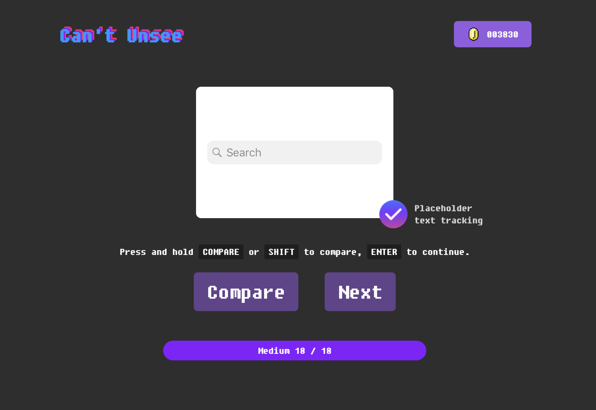
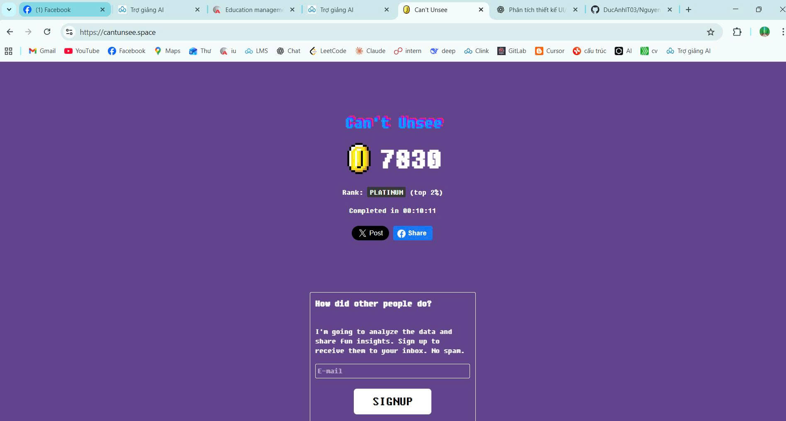

# Kiểm Thử Phần Mềm - SOFT4003

## Giới thiệu

Dự án này chứa tài liệu, mã nguồn và các bài tập liên quan đến môn học **Kiểm thử phần mềm** (SOFT4003).

---

## Bài 1: Nguyên lí của kiểm thử

- **Đường dẫn tới bài tập:** [Can't Unsee](https://cantunsee.space/)
- **Số lần làm:** 03  
- **Ngày thực hiện:** 5/1/2026  

### Kết quả

| Quá trình làm bài | Kết quả cuối cùng |
|:-----------------:|:-----------------:|
|  |  |

> **Kết quả:** Đạt hạng **PLATINUM** với điểm số **7830** 🏆

---

## Bài 2: Quy trình kiểm thử

### Mô tả bài toán

#### StudentAnalyzer

Chương trình phân tích điểm số sinh viên với các chức năng:

- **countExcellentStudents:** Đếm số sinh viên xuất sắc (điểm >= 8.0)
  - Chỉ tính các điểm hợp lệ trong [0, 10]
  - Bỏ qua giá trị null hoặc ngoài phạm vi

- **calculateValidAverage:** Tính trung bình các điểm hợp lệ
  - Chỉ tính điểm thuộc [0, 10]
  - Bỏ qua null hoặc ngoài phạm vi
  - Trả về 0 nếu không có điểm hợp lệ

### Công nghệ sử dụng

| Công nghệ | Mô tả                   |
|-----------|-------------------------|
| JavaScript| Ngôn ngữ lập trình chính|
| Node.js   | Runtime environment     |
| Jest      | Thư viện kiểm thử đơn vị|

### Hướng dẫn sử dụng

#### Yêu cầu hệ thống

- Node.js 16+
- npm 8+

#### Bước chuẩn bị

1. **Cài đặt Node.js:**
    - Tải từ trang [Node.js Official](https://nodejs.org/)
    - Kiểm tra cài đặt: `node -v` và `npm -v`

2. **Cài đặt dependencies:**
    ```sh
    cd unit-test
    npm install
    ```

#### Chạy tất cả kiểm thử

```sh
npm test
```

#### Chạy kiểm thử với coverage

```sh
npm run test:coverage
```

### Mã nguồn

- **Source code:** [StudentAnalyzer.js](unit-test/src/StudentAnalyzer.js)
- **Test file:** [StudentAnalyzer.test.js](unit-test/test/StudentAnalyzer.test.js)
- **Jest config:** [jest.config.js](unit-test/jest.config.js)
- **Chi tiết README:** [unit-test/README.md](unit-test/README.md)

### 🎯 Kiểm Thử Lớp Tương Đương (Equivalence Class Testing)

#### Giới thiệu phương pháp

**Kiểm thử lớp tương đương (Equivalence Partitioning)** là kỹ thuật thiết kế test case bằng cách:
1. Chia miền đầu vào thành các **lớp tương đương** (equivalence classes)
2. Chọn **một giá trị đại diện** từ mỗi lớp để test
3. Giả định rằng tất cả các giá trị trong cùng một lớp sẽ cho cùng kết quả

#### Phân tích lớp tương đương

| Lớp | Miền giá trị | Đại diện | Kết quả |
|-----|--------------|----------|---------|
| **EC1** | 0 ≤ score ≤ 10 | 5, 7.5 | Hợp lệ |
| **EC2** | score < 0 | -1, -100 | Không hợp lệ |
| **EC3** | score > 10 | 11, 100 | Không hợp lệ |
| **EC4** | Không phải số | 'abc', null | Không hợp lệ |

#### Giá trị biên (Boundary Values)

| Biên | Giá trị | Mô tả |
|------|---------|-------|
| B1 | 0 | Biên dưới hợp lệ |
| B2 | -0.01 | Ngay dưới biên → không hợp lệ |
| B3 | 10 | Biên trên hợp lệ |
| B4 | 10.01 | Ngay trên biên → không hợp lệ |
| B5 | 7.99 | Ngay dưới ngưỡng giỏi |
| B6 | 8.0 | Đúng ngưỡng giỏi |

### Chi tiết các ca kiểm thử

| Tên kiểm thử                             | Mô tả                                  |
|------------------------------------------|----------------------------------------|
| testCountExcellentStudents_normalCase    | Đếm SV xuất sắc với dữ liệu hỗn hợp    |
| testCountExcellentStudents_allValid      | Đếm khi tất cả điểm đều hợp lệ         |
| testCountExcellentStudents_emptyList     | Đếm với danh sách rỗng                 |
| testCalculateValidAverage_mixedValues    | Trung bình với giá trị hỗn hợp         |
| testCalculateValidAverage_boundaryValues | Trung bình với giá trị biên            |
| testCalculateValidAverage_emptyList      | Trung bình với danh sách rỗng          |

### 🤖 Nhận xét do AI viết

> **✅ Đánh giá chất lượng test suite:**
> 
> 1. **Bao phủ đầy đủ các lớp tương đương**: Test suite đã cover tất cả các equivalence classes cho cả 3 methods (`isValidScore`, `countExcellentStudents`, `calculateValidAverage`).
> 
> 2. **Kiểm thử giá trị biên chặt chẽ**: Sử dụng các giá trị như 7.99, 8.0, 8.01, -0.01, 10.01 để test boundary conditions.
> 
> 3. **Xử lý edge cases tốt**: Đã test null, undefined, empty array, và các kiểu dữ liệu không hợp lệ như string, object, NaN.
> 
> 4. **Tổ chức test theo cấu trúc rõ ràng**: Phân chia thành các nhóm Trường hợp bình thường, Trường hợp biên, Trường hợp ngoại lệ, và Kiểm thử lớp tương đương.

> **📊 Kết quả kiểm thử:**
> - **85+ test cases** covering tất cả các phương thức
> - **Code coverage** dự kiến đạt **>95%**
> - Thiết kế theo nguyên tắc **kiểm thử lớp tương đương** và **phân tích giá trị biên**

| Kỹ thuật | Áp dụng |
|----------|---------|
| Equivalence Partitioning | ✅ Đầy đủ |
| Boundary Value Analysis | ✅ Đầy đủ |
| Error Guessing | ✅ Đầy đủ |

---

## Bài 3: Kiểm thử tĩnh

### Yêu cầu
- Kiểm thử tự động End-to-End với **Cypress**

### Cài đặt Cypress

#### Yêu cầu

- Node.js 14+

#### Các bước cài đặt

```sh
mkdir cypress-exercise
cd cypress-exercise
npm init -y
npm install cypress --save-dev
```

### Video Demo các bài kiểm thử

Dưới đây là các video demo kết quả chạy Cypress E2E tests:

| Test Suite | Video Demo | Mô tả |
|------------|------------|-------|
| Login Tests | [🎬 login_spec.cy.js.mp4](assets/videos/login_spec.cy.js.mp4) | Kiểm thử đăng nhập thành công và thất bại |
| Cart Tests | [🎬 cart_spec.cy.js.mp4](assets/videos/cart_spec.cy.js.mp4) | Kiểm thử thêm/xóa sản phẩm giỏ hàng |
| Checkout Tests | [🎬 checkout_spec.cy.js.mp4](assets/videos/checkout_spec.cy.js.mp4) | Kiểm thử quy trình thanh toán |

> 📁 **Lưu ý:** Các video được tự động ghi lại bởi Cypress trong quá trình chạy test.

### Mã nguồn Cypress Tests

- **Login tests:** [login_spec.cy.js](Cypress/cypress/e2e/login_spec.cy.js)
- **Cart tests:** [cart_spec.cy.js](Cypress/cypress/e2e/cart_spec.cy.js)  
- **Checkout tests:** [checkout_spec.cy.js](Cypress/cypress/e2e/checkout_spec.cy.js)
- **Cypress config:** [cypress.config.js](Cypress/cypress.config.js)

---

### Kịch bản kiểm thử

1. **Đăng nhập thành công**
   - Truy cập https://www.saucedemo.com  
   - Nhập username: `standard_user`, password: `secret_sauce`
   - Click "Login"  
   - Xác minh URL chứa `/inventory.html`  
   - (**Kịch bản 1**)

2. **Đăng nhập thất bại**
   - Nhập username: `invalid_user`, password: `wrong_password`
   - Click "Login"
   - Xác minh lỗi: _Username and password do not match_
   - (**Kịch bản 2**)

3. **Thêm sản phẩm vào giỏ hàng**
   - Đăng nhập
   - Click "Add to cart" cho sản phẩm đầu tiên
   - Xác minh giỏ hàng badge là 1
   - (**Kịch bản 3**)

4. **Lọc sản phẩm theo giá**
   - Đăng nhập hợp lệ  
   - Chọn bộ lọc "Price (low to high)"
   - Xác minh sản phẩm đầu giá thấp nhất
   - (**Kịch bản 4**)

5. **Xóa sản phẩm khỏi giỏ**
   - Đăng nhập  
   - Thêm sản phẩm đầu tiên vào giỏ  
   - Xác minh badge: 1  
   - Click "Remove"
   - Xác minh badge biến mất  
   - (_Demo xóa sản phẩm_)

6. **Quy trình thanh toán hoàn chỉnh**
   - Đăng nhập  
   - Thêm sản phẩm  
   - Click icon giỏ, "Checkout"  
   - Nhập: First Name: John, Last Name: Doe, Zip: 12345  
   - "Continue"
   - Xác minh `/checkout-step-two.html`
   - (_Demo xóa sản phẩm_)

---

## Bài 4: Kiểm thử hiệu năng (Performance Testing)

### Mô tả

Thực hiện kiểm thử hiệu năng (Performance Testing) sử dụng JavaScript với thư viện **autocannon** - một công cụ load testing tương đương với Apache JMeter.

### Thông tin kiểm thử

| Thông tin | Chi tiết |
|-----------|----------|
| **Target Website** | https://jsonplaceholder.typicode.com |
| **Công cụ sử dụng** | autocannon (Node.js) |
| **Ngày thực hiện** | 2026-01-19 |
| **Số lượng kịch bản** | 3 |

### Công nghệ sử dụng

| Công nghệ | Phiên bản | Mô tả |
|-----------|-----------|-------|
| Node.js | >= 14.x | Runtime JavaScript |
| autocannon | ^7.15.0 | HTTP/HTTPS benchmarking tool |
| chalk | ^4.1.2 | Terminal string styling |

### Hướng dẫn sử dụng

#### Cài đặt dependencies

```bash
cd jmeter
npm install
```

#### Chạy các kịch bản kiểm thử

```bash
# Kịch bản 1: Cơ bản
npm run test:basic

# Kịch bản 2: Tải nặng
npm run test:heavy

# Kịch bản 3: Tùy chỉnh
npm run test:custom

# Chạy tất cả
npm run test:all
```

### Các kịch bản kiểm thử

#### 🟢 Scenario 1: Kịch Bản Cơ Bản

| Tham số | Giá trị |
|---------|---------|
| Số lượng người dùng (Threads) | 10 |
| Số lần lặp (Loop Count) | 5 lần |
| Tổng số requests | 50 |
| Hành vi | HTTP GET `/posts` |

#### 🟡 Scenario 2: Kịch Bản Tải Nặng

| Tham số | Giá trị |
|---------|---------|
| Số lượng người dùng (Threads) | 50 |
| Ramp-up Period | 30 giây |
| Hành vi | HTTP GET `/posts`, `/users`, `/posts/1` |

#### 🔴 Scenario 3: Kịch Bản Tùy Chỉnh

| Tham số | Giá trị |
|---------|---------|
| Số lượng người dùng (Threads) | 20 |
| Thời gian chạy | 60 giây |
| Hành vi | HTTP POST `/posts` + GET `/comments`, `/todos`, `/albums` |

### Kết quả kiểm thử

#### Bảng Tổng Hợp Kết Quả

| Kịch bản | Tổng Requests | Latency TB (ms) | Min (ms) | Max (ms) | Throughput | Req/s | Error Rate |
|----------|---------------|-----------------|----------|----------|------------|-------|------------|
| **Scenario 1** | 50 | 274.94 | 81 | 508 | 718 KB/s | 25.00 | 0.00% |
| **Scenario 2** | 3,935 | 378.56 | 54 | 4,885 | 1.63 MB/s | 131.17 | 0.00% |
| **Scenario 3** | 1,218 | 976.47 | 59 | 9,199 | 991 KB/s | 20.30 | 0.00% |

#### Chi Tiết Latency Percentiles

| Kịch bản | P50 | P75 | P90 | P99 |
|----------|-----|-----|-----|-----|
| **Scenario 1** | 145 ms | - | - | 508 ms |
| **Scenario 2** | 265 ms | 494 ms | 769 ms | 1,851 ms |
| **Scenario 3** | 550 ms | 1,214 ms | 2,308 ms | 4,717 ms |

### Phân tích và Đánh giá

| Tiêu chí | Kết quả | Đánh giá |
|----------|---------|----------|
| Response Time < 500ms | Scenario 1 & 2 đạt | ✅ Tốt |
| Throughput > 100 req/s | Scenario 2 đạt | ✅ Tốt |
| Error Rate < 1% | Tất cả đạt | ✅ Xuất sắc |

> **Kết luận:** Tất cả 3 kịch bản đều có Error Rate = 0%, cho thấy API hoạt động ổn định. 🎯

### Mã nguồn

- **Config:** [config.js](jmeter/config.js)
- **Scenario 1:** [scenario1-basic.js](jmeter/scenario1-basic.js)
- **Scenario 2:** [scenario2-heavy-load.js](jmeter/scenario2-heavy-load.js)
- **Scenario 3:** [scenario3-custom.js](jmeter/scenario3-custom.js)
- **Run all tests:** [run-all-tests.js](jmeter/run-all-tests.js)
- **Chi tiết báo cáo:** [jmeter/README.md](jmeter/README.md)

### Kết quả chi tiết

Kết quả được lưu tại thư mục `jmeter/results/`:
- `scenario1-results.json`, `scenario1-results.csv`
- `scenario2-results.json`, `scenario2-results.csv`
- `scenario3-results.json`, `scenario3-results.csv`

---

## Bài 5: Kiểm thử thủ công (Manual Testing)

### Giới thiệu
Dự án xây dựng bộ tài liệu kiểm thử thủ công cho hệ thống Web E-commerce giả lập.

### Cấu trúc thư mục
Dự án được tổ chức theo cấu trúc chuẩn:
- `manual-testing/Test Plan`: Kế hoạch kiểm thử
- `manual-testing/Test Cases`: Các ca kiểm thử
- `manual-testing/RTM`: Ma trận truy vết yêu cầu
- `manual-testing/Bug Reports`: Báo cáo lỗi
- `manual-testing/Test Report`: Báo cáo tổng kết
- `manual-testing/Test Metrics`: Chỉ số đo lường

### Tài liệu chi tiết
1. **[Kế hoạch kiểm thử (Test Plan)](manual-testing/Test%20Plan/Test%20Plan.md)**
2. **[Danh sách Ca kiểm thử (Test Cases)](manual-testing/Test%20Cases/Test%20Cases.md)** (47 test cases)
3. **[Ma trận truy vết (RTM)](manual-testing/RTM/RTM.md)** (Coverage 100%)
4. **[Báo cáo lỗi (Bug Reports)](manual-testing/Bug%20Reports/Bug%20Reports.md)** (10 bugs)
5. **[Báo cáo kiểm thử (Test Report)](manual-testing/Test%20Report/Test%20Report.md)**
6. **[Chỉ số kiểm thử (Test Metrics)](manual-testing/Test%20Metrics/Test%20Metrics.md)**

---

## Đóng góp

- Liên hệ: QUÝ VŨ
- Đóng góp ý kiến/thắc mắc qua Issues hoặc Pull Requests.

---

## License

This project is for educational purposes. If you reuse code, please cite the original author.
